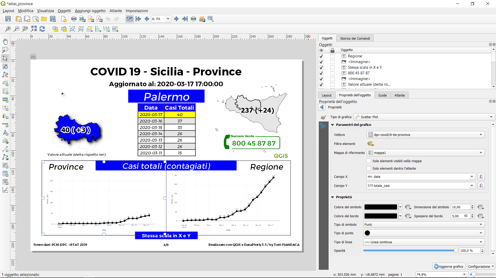

<!-- TOC -->

- [COVID19_Sicilia -- in lavorazione](#covid19sicilia----in-lavorazione)
  - [Perché questo spazio](#perch%c3%a9-questo-spazio)
  - [File di progetto QGIS](#file-di-progetto-qgis)
  - [Cosa c'è in questo repo -- in lavorazione](#cosa-c%c3%a8-in-questo-repo----in-lavorazione)
  - [Espressione usata](#espressione-usata)
  - [Virtual File Format di GDAL/OGR](#virtual-file-format-di-gdalogr)
    - [regioni](#regioni)
    - [province](#province)
  - [Compositore di stampe](#compositore-di-stampe)
    - [Atlas](#atlas)
  - [Caratteristiche utilizzate nel progetto](#caratteristiche-utilizzate-nel-progetto)
  - [Riferimenti utili](#riferimenti-utili)

<!-- /TOC -->

# COVID19_Sicilia -- in lavorazione
Raccolta dati sul COVID19 per scopo informativo.

## Perché questo spazio

Progetto QGIS per la visualizzazione dei dati COVID-19 attraverso un atlas con grafici dinamici - regioni e province ISTAT - fonte : https://github.com/pcm-dpc/COVID-19

## File di progetto QGIS

Il file di progetto QGIS (COVID19_3857_provaut) utilizza come fonte dati il file dpc-covid19-ita-regioni.csv presente nel repository ufficiale del PCM-DPC tramite Protocollo HTTPS, quindi il file si aggiorna automaticamente:


---
NB: il file di progetto è stato realizzato con [QGIS 3.12 București](https://qgis.org/it/site/) e Plugin [DataPlotly 3.5](https://github.com/ghtmtt/DataPlotly)

---

## Cosa c'è in questo repo -- in lavorazione

- cartella `imgs` contiene le immagini utilizzate nel progetto .qgs;
- cartella `risorse` contiene i file utilizzati nel progetto, come:
  - `nroVerdeEmergenzaCOVID19.csv` è una tabella con i numeri verdi regionali per emergenza sanitaria;
  - `nroVerdeEmergenzaCOVID19.csvt` file di servizio per definire la tipologia di campi;
  - shapefile `reg_istat3857.*` limiti amministrativi regionali ISTAT 2019, EPSG:3857;
  - shapefile* `reg_provaut3857.*` limiti amministrativi regionali ISTAT 2019 con Prov. Autonome Trento e Bolzano, EPSG:3857;
  - file `codid19-regioni.vrt` Virtual File Format GDAL/OGR con file CSV raw da GitHub, con geometry Point;
  - file `codid19-regioni_noWKT.vrt` Virtual File Format GDAL/OGR con file CSV raw da GitHub, no geometry;
  - file `codid19-regioni_dw.vrt` collegato a data.word, ma non funziona in QGIS;
  - file `config_grafici_casi_totali.xml` di configurazione grafici atlas;
  - file `COVID19_3857_noVL_ogrVRT_provaut.qpt` modello layouts;
  - file `stemmi_regione.csv` stemmi regionali;
  - file `world_map.gpkg` geopackage con la world map;
  - file `codid19-andamento_nazione.vrt` Virtual File Format GDAL/OGR con file CSV raw da GitHub;
- cartella `PDF` stampe giornaliere dell'Atlas;
- file `COVID19_3857_noVL.qgs` è il file di progetto QGIS in formato `.qgs` (senza usare Virtual layer), EPSG:3857;
- file `COVID19_3857.qgs` è il file di progetto QGIS in formato `.qgs` (usa Virtual layer), EPSG:3857;
- file `COVID19_3857_noVL_ogrVRT.qgs` è il file di progetto QGIS in formato `.qgs`, EPSG:3857 (`OLD-main`), usa OGRVRT;
- file `COVID19_3857_noVL_ogrVRT_provaut.qgs` è il file di progetto QGIS in formato `.qgs`, EPSG:3857 (`main`), usa OGRVRT;
- file `license` è il file che definisce la licenza del repository;
- file `README.md` è questo file, con le info.

[↑ torna su ↑](#perch%c3%a9-questo-spazio)

## Espressione usata

Per calcolo valori incrementali giornalieri è stata usata la seguente espressione nel Campo Y dei grafici `Scatter Plot`

```
with_variable(
'my_exp', 
array_find(  
array_agg( 
expression:= "data" , group_by:= "codice_regione" ,
order_by:="data"),"data"),
if( 
to_int(@my_exp) = 0, 
(array_agg( 
            expression:=  "terapia_intensiva" , 
            group_by:= "codice_regione" ,
            order_by:=  "data"  )[0]),
("terapia_intensiva"  -
(array_agg( 
expression:= "terapia_intensiva", 
group_by:= "codice_regione" ,
order_by:=  "data"  )[to_int(@my_exp)-1]))))
```

PS: per maggiori info sull'espressione: <https://pigrecoinfinito.com/2020/03/10/qgis-creare-grafici-con-incrementi-giornalieri/>


[↑ torna su ↑](#perch%c3%a9-questo-spazio)

## Virtual File Format di GDAL/OGR

### regioni

link utile: <https://gdal.org/drivers/vector/vrt.html#virtual-file-format>

```xml
<OGRVRTDataSource>
<OGRVRTLayer name="dpc-covid19-ita-regioni">
    <SrcDataSource relativeToVRT="0">/vsicurl/https://raw.githubusercontent.com/pcm-dpc/COVID-19/master/dati-regioni/dpc-covid19-ita-regioni.csv</SrcDataSource>
    <Field name="data" type="String" />
    <Field name="lat" type="Real" />
    <Field name="long" type="Real" />
    <Field name="stato" type="String" />
    <Field name="codice_regione" type="String" />
    <Field name="denominazione_regione" type="String" />
	  <Field name="ricoverati_con_sintomi" type="Integer" />
    <Field name="terapia_intensiva" type="Integer" />
    <Field name="totale_ospedalizzati" type="Integer" />
    <Field name="isolamento_domiciliare" type="Integer" />
    <Field name="totale_attualmente_positivi" type="Integer" />
    <Field name="nuovi_attualmente_positivi" type="Integer" />
    <Field name="dimessi_guariti" type="Integer" />
    <Field name="deceduti" type="Integer" />
    <Field name="totale_casi" type="Integer" />
    <Field name="tamponi" type="Integer" />
</OGRVRTLayer>
</OGRVRTDataSource>
```

### province

```xml
<OGRVRTDataSource>
<OGRVRTLayer name="dpc-covid19-ita-province">
    <SrcDataSource relativeToVRT="0">/vsicurl/https://raw.githubusercontent.com/pcm-dpc/COVID-19/master/dati-province/dpc-covid19-ita-province.csv</SrcDataSource>
    <Field name="data" type="String" />
	<Field name="stato" type="String" />
	<Field name="codice_regione" type="String" />
	<Field name="denominazione_regione" type="String" />
	<Field name="codice_provincia" type="String" />
	<Field name="denominazione_provincia" type="String" />
	<Field name="sigla_provincia" type="String" />
	<Field name="totale_casi" type="Integer" />
</OGRVRTLayer>
</OGRVRTDataSource>
```


- per un quadro sinottico del file

```
ogrinfo codid19-regioni_dw.vrt dpc-covid19-ita-regioni -summary
```

- per leggere il file con OGR:

```
ogrinfo codid19-regioni_dw.vrt dpc-covid19-ita-regioni
```

per ottenere il nome layer corretto

```
ogrinfo -ro -al -q CSV:/vsicurl/https://raw.githubusercontent.com/pcm-dpc/COVID-19/master/dati-regioni/dpc-covid19-ita-regioni.csv
```

- per usarlo in QGIS:


## Compositore di stampe

### Atlas

Vettore di copertura : layer `reg_provaut3857`, Font [`TRUENO`](https://www.wfonts.com/font/trueno)



**Gif animata:**


[↑ torna su ↑](#perch%c3%a9-questo-spazio)


## Caratteristiche utilizzate nel progetto

1. Shapefile, Geopackage, CSV, CSV remoti;
2. Join, Relazioni;
3. Atlas con grafici dinamici (Plugin DataPlotly);
4. Layout di stampa Andamento nazionale (Plugin DataPlotly);
5. Visualizzazione immagini remote (Stemmi);
6. Tematizzazione tramite regole;
7. Calcolo valori incrementali giornalieri tramite espressioni;
8. Temi mappe per Atlas;
9. Tabella in relazione nell'Atlas e formattazione condizionale;
10. Panoramica con Generatore di geometria;
11. Etichette con valori raggruppati e incrementali.
12. Decorazioni: Copyright, Immagine e estensioni layout

[↑ torna su ↑](#perch%c3%a9-questo-spazio)

## Riferimenti utili

- **QGIS** : <https://qgis.org/it/site/>
- **Plugin DataPlotly** : <https://github.com/ghtmtt/DataPlotly>
- **Fonti dati PCM-DPC** : <https://github.com/pcm-dpc/COVID-19>
- **CONFINI DELLE UNITÀ AMMINISTRATIVE A FINI STATISTICI AL 1 GENNAIO 2019** : <https://www.istat.it/it/archivio/222527>
- **Word Map** : <https://www.naturalearthdata.com/downloads/10m-cultural-vectors/>
- **Stemmi Regioni Italiane** : <https://it.wikipedia.org/wiki/Stemmi_delle_regioni_italiane>;
- **Font Trueno** : <https://www.wfonts.com/font/trueno>
- **Visual Style Guide** : <https://www.qgis.org/en/site/getinvolved/styleguide.html#trueno-fonts>
- **Visual Studio Code** : <https://code.visualstudio.com/>


**NB:** Tutti i dati prodotti dall’Istituto nazionale di statistica (ISTAT) sono rilasciati sotto [licenza Creative Commons (CC BY 3.0 IT)](https://www.istat.it/it/note-legali): è possibile riprodurre, distribuire, trasmettere e adattare liberamente dati e analisi dell’Istituto nazionale di statistica, anche a scopi commerciali, a **condizione che venga citata la fonte**.

[↑ torna su ↑](#perch%c3%a9-questo-spazio)

